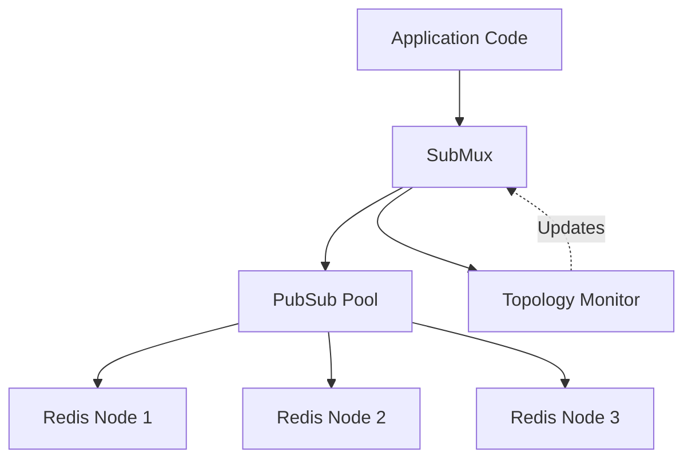

# submux Design Document

## 1. Overview

**submux** is a Go library that minimizes the number of Pub/Sub connections required for Redis Cluster deployments. It sits on top of [go-redis](https://github.com/redis/go-redis/v9) and intelligently multiplexes multiple subscriptions over a small number of dedicated connections.

### 1.1 Problem Statement
The Redis Protocol requires connections to be dedicated to Pub/Sub after a subscription command is sent. In a cluster environment with many nodes and many channels, naively creating a new connection for each subscription (default behavior of many clients) can lead to connection exhaustion and resource inefficiency.

### 1.2 Solution
submux solves this by:
*   **Multiplexing**: Reusing existing connections for subscriptions that map to the same hashslot/node.
*   **Hashslot Awareness**: Calculating hashslots locally to route subscriptions to the correct connection.
*   **Topology Monitoring**: Automatically adjusting to cluster reconfigurations and migrations.
*   **Load Balancing**: Distributing subscriptions across master and replica nodes.

---

## 2. Architecture

### 2.1 High-Level Design



**Components:**
1.  **SubMux**: The main entry point. Wraps `*redis.ClusterClient`. Manages subscriptions and routings.
2.  **PubSub Pool**: Manages physical `*redis.PubSub` connections. Indexes them by hashslot and node address.
3.  **Topology Monitor**: Polls cluster state, detects migrations, and handles recovery.
4.  **Event Loop**: A single goroutine per physical connection handles all I/O (commands and messages).

### 2.2 Connection Multiplexing

The core optimization strategy is **Hashslot-Based Connection Reuse**:
1.  **Map Channel to Hashslot**: `CRC16(channel) % 16384`. Supports `{hash-tag}` syntax.
2.  **Locate Connection**: Check if an active PubSub connection exists for this hashslot (or the node owning it).
3.  **Reuse or Create**:
    *   *Exists*: Reuse the connection. If the channel is already subscribed to by another caller, just add the callback. If not, send `SUBSCRIBE` command.
    *   *Missing*: Create a new `*redis.PubSub` connection to the target node (preferring replicas if configured).

### 2.3 Single Event Loop Architecture

Each physical Redis PubSub connection is managed by a **single event loop goroutine** (implemented in `eventloop.go`). This replaces earlier designs that used separate sender/receiver goroutines.

**Responsibilities:**
*   **Command Sending**: Reads from `cmdCh`, sends `SUBSCRIBE`/`UNSUBSCRIBE` commands to Redis.
*   **Message Processing**: Reads from `PubSub.ChannelWithSubscriptions()`.
*   **Routing**: Dispatches incoming messages to appropriate callbacks based on channel/pattern.
*   **Error Handling**: Detects connection failures and manages state transitions.

**Diagram:**
```
PubSub Connection
└── Event Loop Goroutine
    └── select {
        case cmd := <-cmdCh:
            Send command to Redis
        case msg := <-PubSub.ChannelWithSubscriptions():
            Process message/confirmation
        case <-done:
            Shutdown
        }
```

---

## 3. Resilience and Topology Handling

submux includes advanced logic to handle the dynamic nature of Redis Clusters.

### 3.1 Topology Change Detection
The `Topology Monitor` (`topology.go`) runs in the background:
*   **Polling**: Refreshes cluster state at configurable intervals (default 1s). It calls `ClusterClient.ReloadState()` followed by `ClusterSlots()`.
*   **Diffing**: Compares new topology with previous state to detect:
    *   Hashslot migrations (slots moving between nodes).
    *   Node failures/additions.

### 3.2 Migration Recovery (`auto-resubscribe`)
When a hashslot migration is detected:
1.  **Signal**: A `MessageTypeSignal` event is sent to all affected callbacks immediately.
2.  **Invalidation**: The internal pool cache for that hashslot is invalidated.
3.  **Auto-Resubscribe** (if enabled):
    *   The system unsubscribes from the old node.
    *   It initiates a new subscription sequence on the new owner node.
    *   **Stall Detection**: The resubscription process is monitored. If it stalls (no progress for 2s) or times out (30s), a specific signal (`migration_stalled` or `migration_timeout`) is sent to the application.

### 3.3 Connection Recovery
If a connection fails (EOF, timeout):
1.  The Event Loop detects the failure.
2.  All subscriptions on that connection are marked as `Failed`.
3.  `node_failure` signals are sent to callbacks.
4.  Subsequent operations will attempt to create a fresh connection.

---

## 4. API Design

### 4.1 Core Types
*   **`SubMux`**: The main client wrapper.
*   **`Sub`**: Represents a specific callback's registration. Used to unsubscribe.
*   **`MessageCallback`**: `func(msg *Message)` - invoked asynchronously for all events.

### 4.2 Subscription Methods (`Sync`)
All subscription methods are **synchronous**. They return only after Redis confirms the subscription.

```go
// Returns a Subscription object used to Unsubscribe later
func (sm *SubMux) SubscribeSync(ctx context.Context, channels []string, cb MessageCallback) (*Sub, error)
func (sm *SubMux) PSubscribeSync(ctx context.Context, patterns []string, cb MessageCallback) (*Sub, error)
func (sm *SubMux) SSubscribeSync(ctx context.Context, patterns []string, cb MessageCallback) (*Sub, error)
```

### 4.3 Configuration Options
Configured via functional options in `New()`:
*   `WithAutoResubscribe(bool)`: Enable automatic handling of migrations.
*   `WithReplicaPreference(bool)`: Prefer connecting to replicas to save master bandwidth.
*   `WithTopologyPollInterval(time.Duration)`: customized refresh rate.
*   `WithMinConnectionsPerNode(int)`: Minimum connection pool size.

---

## 5. Testing Strategy

### 5.1 Test Layers
*   **Unit Tests**: Isolated tests for `hashslot`, `pool`, and `subscription` logic. Uses mocked `ClusterClient` via `testutil`.
*   **Integration Tests**: Run against real local Redis Cluster instances.
    *   Located in `integration/`.
    *   Spawns local `redis-server` processes on random ports.
*   **Topology Tests**: Simulates migrations by issuing `CLUSTER SETSLOT` commands and verifying `signal` messages.

### 5.2 Key Scenarios Covered
### 5.2 Key Scenarios & Test Plan

#### Unit Test Scenarios
*   **Hashslot Calculation**:
    *   Verify calculation range [0, 16383].
    *   Verify hashtag support (`{tag}`) matches Redis standard.
    *   Edge cases: empty string, special characters.
*   **Pool Management**:
    *   Verify `getPubSubForHashslot` reuses existing connections.
    *   Verify load balancing (least loaded node selection).
    *   Verify metadata lifecycle (add/remove subscriptions).
*   **Subscription State**:
    *   Verify transitions: `Pending` -> `Active` -> `Closed`.
    *   Verify timeout handling during subscription confirmation.

#### Integration Test Scenarios
*   **Basic Functionality**:
    *   Subscribe to single/multiple channels.
    *   Verify message delivery (payload equality).
    *   Verify pattern (`PSUBSCRIBE`) and sharded (`SSUBSCRIBE`) matching.
*   **Concurrency**:
    *   **Concurrent Subscriptions**: Spawn 100+ goroutines subscribing to unique and shared channels.
    *   **Race Detection**: Run with `-race` flag to catch synchronization issues.
*   **Topology & Resilience**:
    *   **Migration**: Trigger `CLUSTER SETSLOT` to move a slot. Verify `migration` signal is received.
    *   **Node Failures**: Stop a redis node. Verify `node_failure` signal.
    *   **Auto-Resubscribe**: Verify that after migration, subscriptions allow messages to flow again without user intervention.


---

## 6. Best Practices

### 6.1 Resource Management
*   **Always Defer Close**: `defer sub.Unsubscribe(ctx)` and `defer subMux.Close()`.
*   **Store Subscriptions**: You need the `*Subscription` object returned by `SubscribeSync` to unsubscribe specific callbacks later.

### 6.2 Error Handling
*   **Check Errors**: Always check the error returned by `SubscribeSync`.
*   **Listen for Signals**: Your callback *must* handle `MessageTypeSignal` to react to topology changes, even if auto-resubscribe is on (for logging/metrics).

### 6.3 Performance
*   **Batching**: Subscribe to multiple channels in one call (`[]string{"a", "b"}`) rather than loop.
*   **Replicas**: Use `WithReplicaPreference(true)` for read-heavy Pub/Sub workloads.

*   **Fast Callbacks**: Callbacks are async but heavy blocking can affect throughput. Offload generic work to queues.

### 6.4 Production-Ready Example

```go
package main

import (
    "context"
    "log"
    "os"
    "os/signal"
    "syscall"
    "time"

    "github.com/redis/go-redis/v9"
    "github.com/lalloni/submux"
)

func main() {
    // 1. Create cluster client
    clusterClient := redis.NewClusterClient(&redis.ClusterOptions{
        Addrs: []string{"localhost:7000", "localhost:7001"},
    })
    defer clusterClient.Close()

    // 2. Create SubMux with production settings
    subMux, err := submux.New(clusterClient,
        submux.WithAutoResubscribe(true),            // Handle migrations automatically
        submux.WithReplicaPreference(true),          // Read scaling
        submux.WithTopologyPollInterval(2*time.Second),
    )
    if err != nil {
        log.Fatal(err)
    }
    defer subMux.Close() // Critical cleanup

    // 3. Define robust callback
    callback := func(msg *submux.Message) {
        switch msg.Type {
        case submux.MessageTypeSignal:
            log.Printf("Topology event: %s info=%s", msg.Signal.EventType, msg.Signal.Details)
        case submux.MessageTypeMessage:
            log.Printf("Received: %s", msg.Payload)
        }
    }

    // 4. Subscribe with timeout context
    ctx, cancel := context.WithTimeout(context.Background(), 10*time.Second)
    defer cancel()

    sub, err := subMux.SubscribeSync(ctx, []string{"critical-events"}, callback)
    if err != nil {
        log.Fatalf("Subscription failed: %v", err)
    }
    // 5. Ensure specific subscription cleanup
    defer sub.Unsubscribe(context.Background())

    // 6. Block until shutdown signal
    sigCh := make(chan os.Signal, 1)
    signal.Notify(sigCh, syscall.SIGINT, syscall.SIGTERM)
    <-sigCh

    log.Println("Shutting down...")
}
```

---

## 7. Future Roadmap
*   **Advanced Flow Control**: Backpressure handling if callbacks are too slow.
*   **Metrics**: Built-in Prometheus/OpenTelemetry hooks for connection state and throughput.
*   **Dynamic Tuning**: Auto-adjusting pool sizes based on load.
