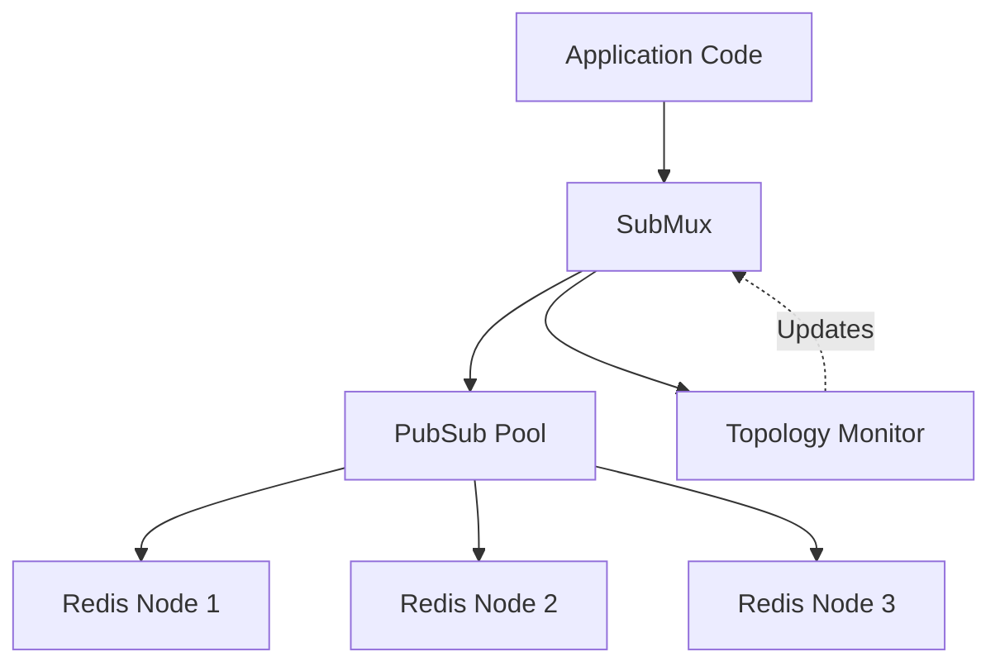

# submux Design Document

## 1. Overview

**submux** is a Go library that minimizes the number of Pub/Sub connections required for Redis Cluster deployments. It sits on top of [go-redis](https://github.com/redis/go-redis/v9) and intelligently multiplexes multiple subscriptions over a small number of dedicated connections.

### 1.1 Problem Statement
The Redis Protocol requires connections to be dedicated to Pub/Sub after a subscription command is sent. In a cluster environment with many nodes and many channels, naively creating a new connection for each subscription (default behavior of many clients) can lead to connection exhaustion and resource inefficiency.

### 1.2 Solution
submux solves this by:
*   **Multiplexing**: Reusing existing connections for subscriptions that map to the same hashslot/node.
*   **Hashslot Awareness**: Calculating hashslots locally to route subscriptions to the correct connection.
*   **Topology Monitoring**: Automatically adjusting to cluster reconfigurations and migrations.
*   **Load Balancing**: Distributing subscriptions across master and replica nodes.

---

## 2. Architecture

### 2.1 High-Level Design



**Components:**
1.  **SubMux**: The main entry point. Wraps `*redis.ClusterClient`. Manages subscriptions and routings.
2.  **PubSub Pool**: Manages physical `*redis.PubSub` connections. Indexes them by hashslot and node address.
3.  **Topology Monitor**: Polls cluster state, detects migrations, and handles recovery.
4.  **Event Loop**: A single goroutine per physical connection handles all I/O (commands and messages).

### 2.2 Connection Multiplexing

The core optimization strategy is **Hashslot-Based Connection Reuse**:
1.  **Map Channel to Hashslot**: `CRC16(channel) % 16384`. Supports `{hash-tag}` syntax.
2.  **Locate Connection**: Check if an active PubSub connection exists for this hashslot (or the node owning it).
3.  **Reuse or Create**:
    *   *Exists*: Reuse the connection. If the channel is already subscribed to by another caller, just add the callback. If not, send `SUBSCRIBE` command.
    *   *Missing*: Create a new `*redis.PubSub` connection to the target node (preferring replicas if configured).

### 2.3 Single Event Loop Architecture

Each physical Redis PubSub connection is managed by a **single event loop goroutine** (implemented in `eventloop.go`). This replaces earlier designs that used separate sender/receiver goroutines.

**Responsibilities:**
*   **Command Sending**: Reads from `cmdCh`, sends `SUBSCRIBE`/`UNSUBSCRIBE` commands to Redis.
*   **Message Processing**: Reads from `PubSub.ChannelWithSubscriptions()`.
*   **Routing**: Dispatches incoming messages to appropriate callbacks based on channel/pattern.
*   **Error Handling**: Detects connection failures and manages state transitions.

**Diagram:**
```
PubSub Connection
└── Event Loop Goroutine
    └── select {
        case cmd := <-cmdCh:
            Send command to Redis
        case msg := <-PubSub.ChannelWithSubscriptions():
            Process message/confirmation
        case <-done:
            Shutdown
        }
```

### 2.4 Lock Ordering

To prevent deadlocks, locks must be acquired in a consistent order throughout the codebase. The lock acquisition order from highest to lowest priority is:

```
1. SubMux.mu              (subscription management)
2. topologyMonitor.mu     (topology refresh coordination)
3. topologyState.mu       (topology data access)
4. pubSubPool.mu          (connection pool management)
5. pubSubMetadata.mu      (per-connection state)
```

**Key Rules:**
*   Never acquire a higher-priority lock while holding a lower-priority lock.
*   When multiple locks are needed, acquire them in the order listed above.
*   Release locks in reverse order of acquisition.
*   Prefer copying state references under a lock, then releasing the lock before calling methods that may acquire other locks.

**Example Pattern** (from `topology.go`):
```go
// Copy state reference under lock to avoid nested lock acquisition
tm.mu.Lock()
state := tm.currentState
tm.mu.Unlock()

// Now safely access topologyState methods (which acquire their own lock)
if state != nil {
    return state.getNodeForHashslot(hashslot)
}
```

---

## 3. Resilience and Topology Handling

submux includes advanced logic to handle the dynamic nature of Redis Clusters.

### 3.1 Topology Change Detection
submux uses two complementary mechanisms to detect topology changes:

**Periodic Polling** - The `Topology Monitor` (`topology.go`) runs in the background:
*   **Polling**: Refreshes cluster state at configurable intervals (default 1s). It calls `ClusterClient.ReloadState()` followed by `ClusterSlots()`.
*   **Diffing**: Compares new topology with previous state to detect:
    *   Hashslot migrations (slots moving between nodes).
    *   Node failures/additions.

**Real-time MOVED/ASK Detection** - The Event Loop (`eventloop.go`) detects redirect errors:
*   When a subscription command returns a MOVED or ASK error, `checkAndHandleRedirect()` immediately triggers a topology refresh via `topologyMonitor.triggerRefresh()`.
*   This provides faster migration detection than waiting for the next poll interval.

### 3.2 Migration Recovery (`auto-resubscribe`)
When a hashslot migration is detected:
1.  **Signal**: A `MessageTypeSignal` event is sent to all affected callbacks immediately.
2.  **Invalidation**: The internal pool cache for that hashslot is invalidated.
3.  **Auto-Resubscribe** (if enabled):
    *   The system unsubscribes from the old node.
    *   It initiates a new subscription sequence on the new owner node.
    *   **Stall Detection**: The resubscription process is monitored. If it stalls (no progress for 2s) or times out (30s), a specific signal (`migration_stalled` or `migration_timeout`) is sent to the application.

### 3.3 Connection Recovery
If a connection fails (EOF, timeout):
1.  The Event Loop detects the failure.
2.  All subscriptions on that connection are marked as `Failed`.
3.  `node_failure` signals are sent to callbacks.
4.  Subsequent operations will attempt to create a fresh connection.

---

## 4. API Design

### 4.1 Core Types
*   **`SubMux`**: The main client wrapper.
*   **`Sub`**: Represents a specific callback's registration. Used to unsubscribe.
*   **`MessageCallback`**: `func(ctx context.Context, msg *Message)` - invoked asynchronously for all events. The context is derived from the SubMux lifecycle and is canceled when `Close()` is called.

### 4.2 Subscription Methods (`Sync`)
All subscription methods are **synchronous**. They return only after Redis confirms the subscription.

```go
// Returns a Subscription object used to Unsubscribe later
func (sm *SubMux) SubscribeSync(ctx context.Context, channels []string, cb MessageCallback) (*Sub, error)
func (sm *SubMux) PSubscribeSync(ctx context.Context, patterns []string, cb MessageCallback) (*Sub, error)
func (sm *SubMux) SSubscribeSync(ctx context.Context, patterns []string, cb MessageCallback) (*Sub, error)
```

### 4.3 Configuration Options
Configured via functional options in `New()`:
*   `WithAutoResubscribe(bool)`: Enable automatic handling of migrations.
*   `WithNodePreference(NodePreference)`: Set node distribution strategy (default: `BalancedAll`):
    -   `PreferMasters`: Route all subscriptions to master nodes only
    -   `BalancedAll`: Distribute equally across all nodes (masters + replicas) for optimal resource utilization
    -   `PreferReplicas`: Prefer replicas to protect write-saturated masters
*   `WithReplicaPreference(bool)`: **Deprecated** - Use `WithNodePreference()` for clearer intent.
*   `WithTopologyPollInterval(time.Duration)`: Customized refresh rate.
*   `WithMinConnectionsPerNode(int)`: Minimum connection pool size.
*   `WithMigrationTimeout(time.Duration)`: Maximum duration to wait for migration resubscription (default 30s).
*   `WithMigrationStallCheck(time.Duration)`: How often to check for stalled migration progress (default 2s).
*   `WithMeterProvider(metric.MeterProvider)`: OpenTelemetry MeterProvider for production observability (default: `nil`, metrics disabled).
*   `WithCallbackWorkers(int)`: Number of worker goroutines for callback execution (default: `runtime.NumCPU() * 2`).
*   `WithCallbackQueueSize(int)`: Maximum pending callbacks in the worker pool queue (default: `10000`).

---

## 5. Testing Strategy

### 5.1 Test Layers
*   **Unit Tests**: Isolated tests for `hashslot`, `pool`, and `subscription` logic. Uses mocked `ClusterClient` via `testutil`.
*   **Integration Tests**: Run against real local Redis Cluster instances.
    *   Located in `integration/`.
    *   Spawns local `redis-server` processes on random ports.
*   **Topology Tests**: Simulates migrations by issuing `CLUSTER SETSLOT` commands and verifying `signal` messages.

### 5.2 Key Scenarios Covered
### 5.2 Key Scenarios & Test Plan

#### Unit Test Scenarios
*   **Hashslot Calculation**:
    *   Verify calculation range [0, 16383].
    *   Verify hashtag support (`{tag}`) matches Redis standard.
    *   Edge cases: empty string, special characters.
*   **Pool Management**:
    *   Verify `getPubSubForHashslot` reuses existing connections.
    *   Verify load balancing (least loaded node selection).
    *   Verify metadata lifecycle (add/remove subscriptions).
*   **Subscription State**:
    *   Verify transitions: `Pending` -> `Active` -> `Closed`.
    *   Verify timeout handling during subscription confirmation.

#### Integration Test Scenarios
*   **Basic Functionality**:
    *   Subscribe to single/multiple channels.
    *   Verify message delivery (payload equality).
    *   Verify pattern (`PSUBSCRIBE`) and sharded (`SSUBSCRIBE`) matching.
*   **Concurrency**:
    *   **Concurrent Subscriptions**: Spawn 100+ goroutines subscribing to unique and shared channels.
    *   **Race Detection**: Run with `-race` flag to catch synchronization issues.
*   **Topology & Resilience**:
    *   **Migration**: Trigger `CLUSTER SETSLOT` to move a slot. Verify `migration` signal is received.
    *   **Node Failures**: Stop a redis node. Verify `node_failure` signal.
    *   **Auto-Resubscribe**: Verify that after migration, subscriptions allow messages to flow again without user intervention.
    *   **Chaos Testing**: Simulate random node failures and rolling restarts under load to ensure long-term stability using `resiliency_test.go`.


---

## 6. Best Practices

### 6.1 Resource Management
*   **Always Defer Close**: `defer sub.Unsubscribe(ctx)` and `defer subMux.Close()`.
*   **Store Subscriptions**: You need the `*Subscription` object returned by `SubscribeSync` to unsubscribe specific callbacks later.

### 6.2 Error Handling
*   **Check Errors**: Always check the error returned by `SubscribeSync`.
*   **Listen for Signals**: Your callback *must* handle `MessageTypeSignal` to react to topology changes, even if auto-resubscribe is on (for logging/metrics).

### 6.3 Performance
*   **Batching**: Subscribe to multiple channels in one call (`[]string{"a", "b"}`) rather than loop.
*   **Node Distribution**:
    - Use `WithNodePreference(BalancedAll)` (default) for most workloads - distributes load across all infrastructure
    - Use `WithNodePreference(PreferReplicas)` only when masters are write-saturated and need protection
    - Use `WithNodePreference(PreferMasters)` to minimize nodes involved (rarely needed)

*   **Fast Callbacks**: Callbacks are async but heavy blocking can affect throughput. Offload generic work to queues.

### 6.4 Production-Ready Example

```go
package main

import (
    "context"
    "log"
    "os"
    "os/signal"
    "syscall"
    "time"

    "github.com/redis/go-redis/v9"
    "github.com/lalloni/submux"
    sdkmetric "go.opentelemetry.io/otel/sdk/metric"
    "go.opentelemetry.io/otel/exporters/prometheus"
)

func main() {
    // 1. Create cluster client
    clusterClient := redis.NewClusterClient(&redis.ClusterOptions{
        Addrs: []string{"localhost:7000", "localhost:7001"},
    })
    defer clusterClient.Close()

    // 2. Configure OpenTelemetry metrics (optional)
    exporter, _ := prometheus.New()
    meterProvider := sdkmetric.NewMeterProvider(sdkmetric.WithReader(exporter))

    // 3. Create SubMux with production settings
    subMux, err := submux.New(clusterClient,
        submux.WithAutoResubscribe(true),            // Handle migrations automatically
        submux.WithNodePreference(submux.BalancedAll), // Distribute across all nodes (default)
        submux.WithTopologyPollInterval(2*time.Second),
        submux.WithMeterProvider(meterProvider),     // Enable observability
    )
    if err != nil {
        log.Fatal(err)
    }
    defer subMux.Close() // Critical cleanup

    // 4. Define robust callback
    callback := func(ctx context.Context, msg *submux.Message) {
        switch msg.Type {
        case submux.MessageTypeSignal:
            log.Printf("Topology event: %s info=%s", msg.Signal.EventType, msg.Signal.Details)
        case submux.MessageTypeMessage:
            log.Printf("Received: %s", msg.Payload)
        }
    }

    // 5. Subscribe with timeout context
    ctx, cancel := context.WithTimeout(context.Background(), 10*time.Second)
    defer cancel()

    sub, err := subMux.SubscribeSync(ctx, []string{"critical-events"}, callback)
    if err != nil {
        log.Fatalf("Subscription failed: %v", err)
    }
    // 6. Ensure specific subscription cleanup
    defer sub.Unsubscribe(context.Background())

    // 7. Block until shutdown signal
    sigCh := make(chan os.Signal, 1)
    signal.Notify(sigCh, syscall.SIGINT, syscall.SIGTERM)
    <-sigCh

    log.Println("Shutting down...")
}
```

### 6.5 Observability

submux provides built-in OpenTelemetry metrics for production monitoring and debugging. Metrics are **opt-in** and have **zero overhead** when not configured.

#### 6.5.1 Metrics Architecture

**Design Principles:**
*   **Optional**: Metrics disabled by default (no-op implementation)
*   **Zero Overhead**: No-op recorder has 0.1ns overhead (compiler-inlined)
*   **Cardinality Safe**: No channel names as attributes (prevents metric explosion)
*   **Standard Naming**: Uses `submux.*` prefix following OTEL conventions

**Implementation:**
*   **Abstraction Layer**: Internal `metricsRecorder` interface decouples business logic from OTEL
*   **Build Tags**: Can compile without OTEL using `-tags nometrics`
*   **Strong Typing**: Uses `metric.MeterProvider` type (not `interface{}`)

#### 6.5.2 Available Metrics

**Counters (13):**
| Metric Name | Description | Attributes |
|-------------|-------------|------------|
| `submux.messages.received` | Messages from Redis | subscription_type, node_address |
| `submux.callbacks.invoked` | Callback invocations | subscription_type |
| `submux.callbacks.panics` | Panic recoveries | subscription_type |
| `submux.subscriptions.attempts` | Subscription attempts | subscription_type, success |
| `submux.connections.created` | Connections created | node_address |
| `submux.connections.failed` | Connection failures | node_address, error_type |
| `submux.migrations.started` | Migrations detected | - |
| `submux.migrations.completed` | Migrations finished | - |
| `submux.migrations.stalled` | Stalled migrations (>2s) | - |
| `submux.migrations.timeout` | Migration timeouts (>30s) | - |
| `submux.topology.refreshes` | Topology refresh attempts | success |
| `submux.workerpool.submissions` | Callback submissions to pool | blocked |
| `submux.workerpool.dropped` | Callbacks dropped (pool stopped) | - |

**Histograms (5):**
| Metric Name | Description | Unit | Attributes |
|-------------|-------------|------|------------|
| `submux.callbacks.latency` | Callback execution time | ms | subscription_type |
| `submux.messages.latency` | End-to-end message latency | ms | subscription_type |
| `submux.migrations.duration` | Migration completion time | ms | - |
| `submux.topology.refresh_latency` | Topology refresh time | ms | - |
| `submux.workerpool.queue_wait` | Queue wait time before execution | ms | - |

**Observable Gauges (2):**
| Metric Name | Description | Unit | Attributes |
|-------------|-------------|------|------------|
| `submux.workerpool.queue_depth` | Current tasks in queue | {task} | - |
| `submux.workerpool.queue_capacity` | Maximum queue capacity | {task} | - |

#### 6.5.3 Cardinality Management

**Safe Attributes (Low Cardinality):**
*   `subscription_type`: 3 values (`subscribe`, `psubscribe`, `ssubscribe`)
*   `node_address`: Bounded by cluster size (typically <100 nodes)
*   `success`: 2 values (`true`, `false`)
*   `error_type`: Bounded set of error types

**Avoided Attributes (High Cardinality):**
*   ❌ Channel names (unbounded, user-controlled)
*   ❌ Hashslot numbers (16,384 possible values)
*   ❌ Pattern strings (unbounded)

#### 6.5.4 Performance Characteristics

**Benchmarks** (Intel Core i9-13900HX):
```
BenchmarkNoopMetrics_Overhead              0.1 ns/op    0 B/op    0 allocs/op
BenchmarkOtelMetrics_CounterOverhead     210.0 ns/op  296 B/op    4 allocs/op
BenchmarkOtelMetrics_HistogramOverhead   152.2 ns/op  168 B/op    4 allocs/op
```

**Analysis:**
*   No-op overhead is negligible (0.1ns)
*   OTEL overhead is minimal compared to network I/O (1-10ms typical)
*   Adding metrics costs <0.002% of total operation latency

#### 6.5.5 Integration Example

See section 6.4 for a complete production example with Prometheus integration.

---

### 6.6 Worker Pool Architecture

Callbacks are executed through a **bounded worker pool** that prevents goroutine explosion under high message throughput.

**Design:**
```
Messages → Worker Pool Queue → Worker Goroutines → Callback Execution
              (bounded)         (fixed count)
```

**Configuration:**
*   `WithCallbackWorkers(n)`: Number of worker goroutines (default: `runtime.NumCPU() * 2`)
*   `WithCallbackQueueSize(n)`: Queue capacity (default: `10000`)

**Backpressure Behavior:**
*   When the queue is full, `invokeCallback()` blocks until space is available
*   This propagates backpressure to the Redis message processing pipeline
*   Use the `submux.workerpool.queue_wait` metric to monitor queue latency

**Metrics:**
| Metric Name | Type | Description |
|-------------|------|-------------|
| `submux.workerpool.submissions` | Counter | Total callback submissions (attribute: `blocked=true` when queue was full) |
| `submux.workerpool.dropped` | Counter | Callbacks dropped when pool was stopped |
| `submux.workerpool.queue_wait` | Histogram | Time callbacks wait in queue before execution (ms) |
| `submux.workerpool.queue_depth` | Observable Gauge | Current number of tasks in queue |
| `submux.workerpool.queue_capacity` | Observable Gauge | Maximum queue capacity |

**Lifecycle:**
*   Workers start when `New()` is called
*   Workers stop when `Close()` is called, draining any remaining tasks
*   The callback context (`ctx` parameter) is canceled when `Close()` is called

---

## 7. Future Roadmap
*   **Observable Gauges**: Polling-based metrics for active subscriptions and connections. (Worker pool gauges `queue_depth` and `queue_capacity` are already implemented.)
*   **Dynamic Tuning**: Auto-adjusting pool sizes based on load.
